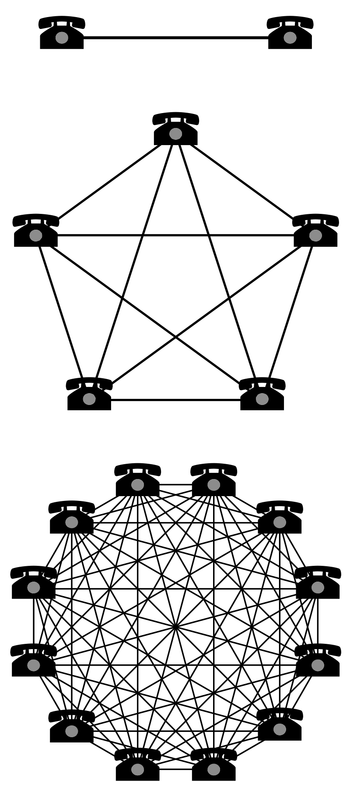

# Bitcoin_Valuation_Model
#### A model to estimate whether current Bitcoin price is supported by activity on the network.

## Introduction
Since 2017 Bitcoin and the cryptocurreny universe has attracted massive attention and has been a personal interest of mine. While researching ways to value Bitcoin and other cryptocurencies, I came accross the work of Chris Burniske and his book, Cryptoassets: The Innovative Investor's Guide to Bitcoin and Beyond, and became fascinated with his method to determine the fundamental value of cryptocurrenies using Metcalfe's Law.

### Metcalfe's Law
Metcalfe's Law, states that the value of a telecommunications network is proportional to the square of the number of connected users of the system (NV ~ n2).

Two telephones can make only one connection, five can make 10 connections, and twelve can make 66 connections.

This graphic pulled from wikipedia nicely illustrates the significance of Metcalfe's Law.
