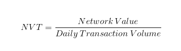
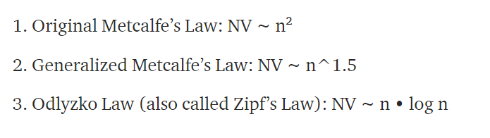
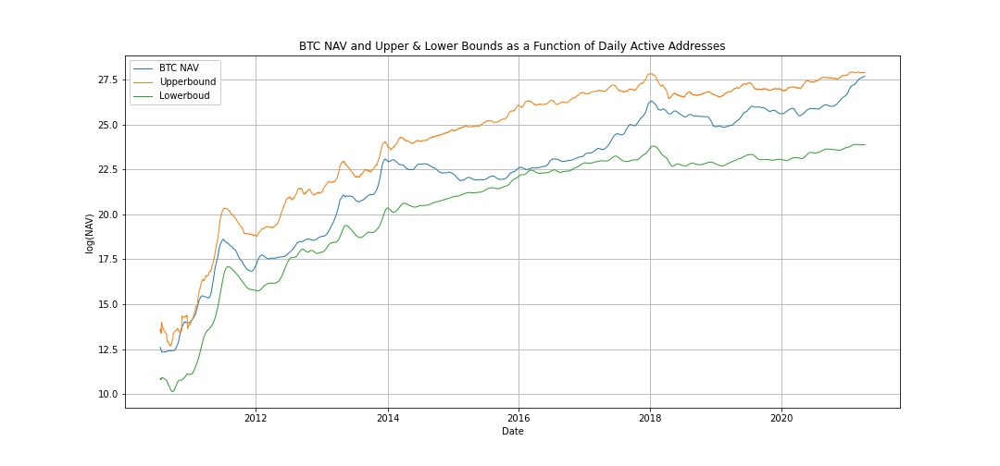
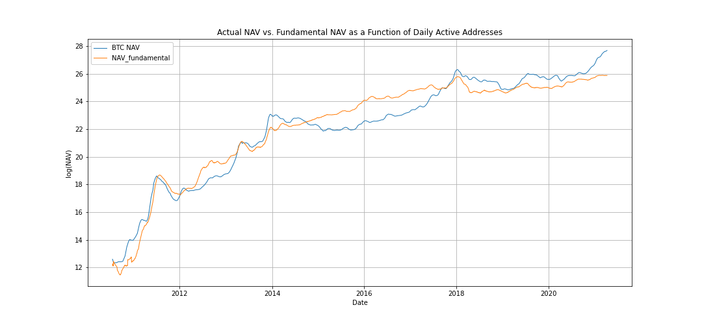
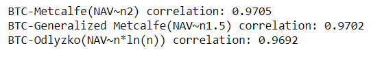

# Bitcoin Valuation Model

A model to estimate whether current Bitcoin price is supported by activity on the network, based on **Metcalfe's Law**.

> 🚀 **NEW: Live Web Dashboard** - We've transformed the static notebook into a real-time web application! See [dashboard/README.md](dashboard/README.md) for details.

---

## Quick Links

- 📊 **Live Dashboard**: [http://localhost:3000](http://localhost:3000) (when running locally)
- 📖 **Dashboard Docs**: [dashboard/README.md](dashboard/README.md)
- 🚀 **Quick Start**: [dashboard/QUICKSTART.md](dashboard/QUICKSTART.md)
- 📓 **Original Analysis**: [model.ipynb](model.ipynb)

---

## Overview

This project implements a Bitcoin valuation model using **Metcalfe's Law** to determine if BTC price is supported by network activity. The model uses **Daily Active Addresses (DAA)** as the primary metric.

### Metcalfe's Law
> The value of a network is proportional to the square of the number of connected users: **NV ~ n²**


### Key Features

- **Upper Boundary**: Metcalfe's Law (NV ~ n²) - optimistic scenario
- **Lower Boundary**: Odlyzko's Law (NV ~ n×ln(n)) - conservative scenario
- **Fundamental NAV**: Midpoint of upper and lower boundaries
- **Correlation**: ~0.970 between actual price and Metcalfe-derived value

---

## What's New: Live Dashboard

We've completely rebuilt this project as a modern web application:

### ✨ Dashboard Features
- **Real-time Data**: Automatic daily updates from BGeometrics API
- **Interactive Charts**: Time range selection, zoom, hover tooltips
- **Valuation Signals**: Overvalued 🔴 / Fair 🟡 / Undervalued 🟢 indicators
- **Correlation Stats**: Statistical validation of all three law variations
- **Historical Analysis**: Full data from 2009 to present

### 🏗️ Architecture
```
dashboard/
├── api/              # FastAPI Backend (Python)
├── pipeline/         # Data Pipeline - Auto daily sync
├── shared/           # Core Models - Refactored from notebook
└── webapp/           # Next.js Frontend (React/TypeScript)
```

### 🚀 Run the Dashboard

```bash
cd dashboard

# Option 1: Docker (Recommended)
docker-compose up --build -d
open http://localhost:3000

# Option 2: Manual
# Terminal 1: Backend
pip install -r api/requirements.txt -r pipeline/requirements.txt
cd api/src && uvicorn main:app --port 8000

# Terminal 2: Frontend
cd webapp && npm install && npm run dev
```

See [QUICKSTART.md](dashboard/QUICKSTART.md) for detailed instructions.

---

## Original Research

### Background
This research was inspired by Dmitry Kalichkin's work on cryptoasset valuation:
- **Article**: [Rethinking Metcalfe's Law applications to cryptoasset valuation](https://link.medium.com/TyrugPb9ofb)
- **Previous Work**: Chris Burniske's NVT Ratio (Network Value to Transactions)

### NVT Ratio
The "crypto PE ratio" - compares market cap to on-chain transaction volume:



> **Note**: Only on-chain transactions are included. Exchange trading is excluded as speculative activity.

### Metcalfe Variations

Three variations of the law were studied:

| Law | Formula | Use Case |
|-----|---------|----------|
| **Metcalfe's** | NV ~ n² | Upper boundary (optimistic) |
| **Generalized** | NV ~ n^1.5 | Middle ground |
| **Odlyzko's** | NV ~ n×ln(n) | Lower boundary (conservative) |



---

## Methodology

### Data Source
- **Primary**: [BGeometrics API](https://charts.bgeometrics.com) - Free Bitcoin on-chain data
- **Backup**: [CoinMetrics](https://coinmetrics.io) Community API
- **Legacy**: CoinMetrics CSV export (used in original analysis)

### Calculations

#### Upper Boundary (Metcalfe's Law)
```
metcalfe_n = n²
upper_bound = ln(SMA_30(metcalfe_n))
```

#### Lower Boundary (Odlyzko's Law)
```
odlyzko_n = n × ln(n)
lower_bound = -3.48 + 1.65 × SMA_30(ln(SMA_30(odlyzko_n)))
```

#### Fundamental NAV
```
NAV = (upper_bound + lower_bound) / 2
```

Where **n** = Daily Active Addresses

**Constants** (a₁, b₁, a₂, b₂) were empirically derived to create the narrowest channel containing actual network value.

### Visualizations

**Upper & Lower Boundaries vs Daily Active Addresses:**



**Actual NAV vs Fundamental NAV:**



---

## Results

The correlation between Bitcoin's actual price and Metcalfe's Law variations is **~0.970**:



### Key Findings
- Network value strongly correlates with Daily Active Addresses
- On-chain transactions (not exchange trading) drive fundamental value
- Model provides clear overvaluation/undervaluation signals
- Differences between law variations are negligible (~0.001)

---

## Project Structure

```
Bitcoin_Valuation_Model/
├── model.ipynb              # Original Jupyter notebook analysis
├── README.md                # This file
├── dashboard/               # NEW: Live web dashboard
│   ├── README.md
│   ├── QUICKSTART.md
│   ├── api/                 # FastAPI backend
│   ├── pipeline/            # Data pipeline
│   ├── shared/              # Core models (refactored from notebook)
│   └── webapp/              # Next.js frontend
├── resources/
│   ├── btc.csv              # Legacy dataset
│   └── *.png                # Formula/visualization assets
└── .gitignore
```

---

## Technology Stack

### Original Analysis
- **Python 3.7+**
- **Jupyter Notebook**
- **pandas, numpy, matplotlib**

### New Dashboard
- **Backend**: Python 3.11, FastAPI, SQLAlchemy, SQLite/PostgreSQL
- **Pipeline**: APScheduler, BGeometrics API, pandas
- **Frontend**: Next.js 14, TypeScript, Tailwind CSS, Recharts
- **Deployment**: Docker, Docker Compose

---

## API Endpoints

The dashboard exposes a REST API at `http://localhost:8000`:

| Endpoint | Description |
|----------|-------------|
| `GET /api/metrics/latest` | Current BTC metrics & valuation |
| `GET /api/metrics/historical` | Time-series data for charts |
| `GET /api/valuation/status` | Over/under-valued status |
| `GET /api/correlations` | Correlation statistics |
| `GET /api/stats` | Database statistics |

Full API documentation: `http://localhost:8000/docs`

---

## Contributing

This project is for educational purposes. The original analysis was conducted in early 2021. The new dashboard extends this work with real-time data capabilities.

---

## License

MIT - Feel free to use and modify!

---

## Acknowledgments

- **Dmitry Kalichkin** - Inspiration for Metcalfe's Law application to crypto
- **Chris Burniske** - NVT Ratio methodology
- **BGeometrics** - Free on-chain data API
- **CoinMetrics** - Historical data source

---

## Disclaimer

> **Not financial advice.** This model is for educational and research purposes only. Cryptocurrency investments carry significant risk. Always do your own research.
