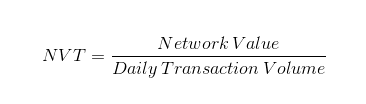
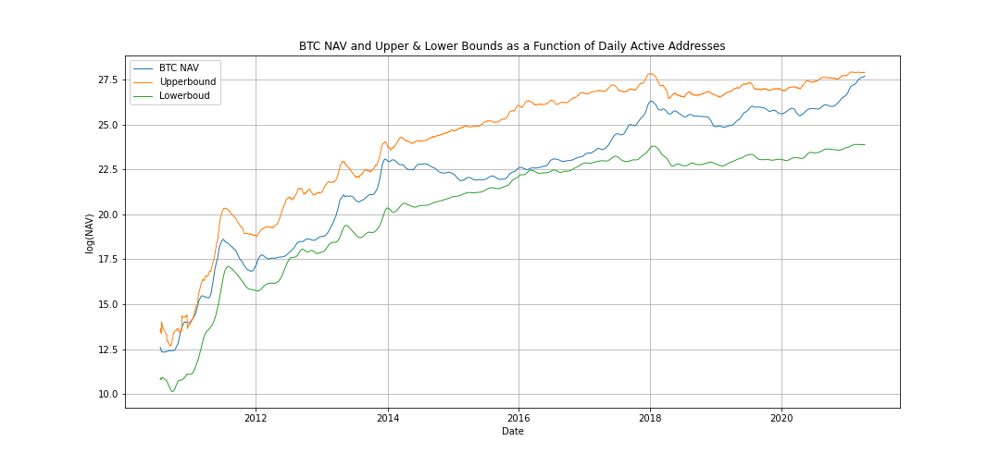
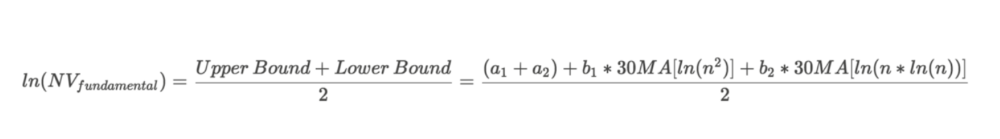
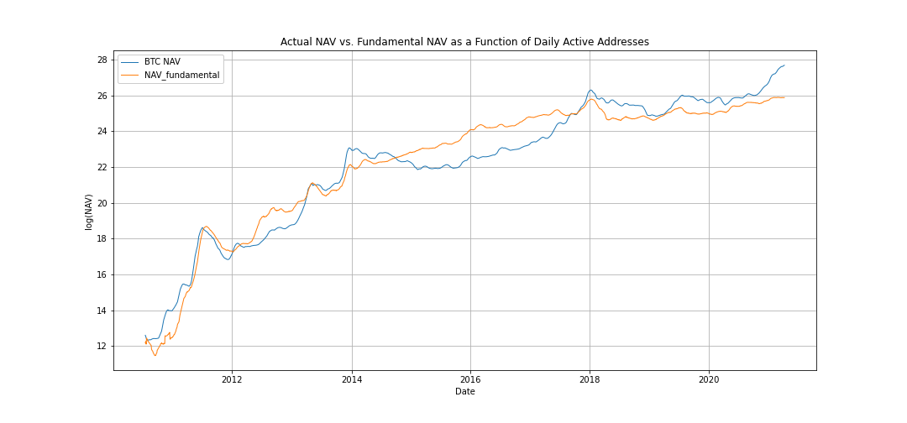
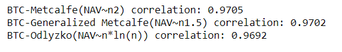

# Bitcoin_Valuation_Model
#### A model to estimate whether current Bitcoin price is supported by activity on the network.

#### A special thanks to Dmitry Kalichkin for the inspiration to continue the work by CryptoLab Capital found in his post on medium.com
**Rethinking Metcalfe’s Law applications to cryptoasset valuation** by @Kalichkin https://link.medium.com/TyrugPb9ofb 

## Introduction
Since 2017 Bitcoin and the cryptocurrency universe has attracted massive attention and has been a personal interest of mine. While researching ways to value Bitcoin and other cryptocurrencies, I came across the work of Chris Burniske and his book, Cryptoassets: The Innovative Investor's Guide to Bitcoin and Beyond. I quickly became fascinated with his method to determine the fundamental value of cryptocurrencies using Network Value to Transactions (NVT), often called "crypto PE ratio".

In traditional finance, Price-to-Earnings ratio (PE ratio) is used as a proxy for the underlying equity to measure and compare the value of a company to its peers or competitors. PE ratio is calculated by taking the share price in the numerator and dividing it by the company's Earnings per Share (EPS) in the denominator. The resulting ratio can be used for comparison against other peer company PE ratios as it eliminates unique metrics such as outstanding share count across different companies.

While crytocurrenies or cryptoassets don't have earnings, one can argue that the total value of transactions flowing through the network is a proxy for how much utility users derive from the blockchain.
**Note:** Daily Transaction Volume in NVT takes into account only on-chain transactions. All the trading activity that happens on exhanges is considered speculative and not included in this measure.

### Metcalfe's Law
Metcalfe's Law, states that the value of a telecommunications network is proportional to the square of the number of connected users of the system (NV ~ n2).

Two telephones can make only one connection, five can make 10 connections, and twelve can make 66 connections.

Critics of Metcalfe's Law point to the fact that not all network connections or users contribute equally to the network, to account for this I used Metcalfe's Law (NV ~ n2) along with two variations being Odlyzko's Law and Generalized Metcalfe's Law (Clearblocks determination) shown below:

## Objective
In this study, the goal was to estimate whether Bitcoin's price is supported by activity on the network. To do this, upper and lower bounds for Bitcoin Network Value were derived based on the number of Daily Active Addresses (DAA). 

## Data
Daily data for Bitcoin NAV and Daily Active Addresses was sourced from https://coinmetrics.io and consisted of a downloadable csv as they no longer support free API connections.

## Developing Fundamental Upper & Lower Boundaries

Metcalfe's Original Law (NV ~ n2) was used to create the upper fundamental value boundary for Bitcoin. The original law was chosen for the upper boundary because it is the most liberal and considers each and every user equally contributes to the value of the network which is idealistic but makes for a logical upper boundary.

Odlyzko's Law (NV ~ n*ln(n)) was used to create the lower fundamental value boundary. Odlyzko's Law, being the most conservative of the 3 variations studied made the most sense to use for the lower boundary.

### Calculations

## Normalizing Upper and Lower Boundaries

The fundamental upper and lower boundaries that were derived above were then normalized by taking the sum of the boundaries and dividing them by 2 to create a fundamental valuation of the Bitcoin network. The fundamental valuation was plotted against Bitcoin price to examine the correlation.

Values (a1, a2, b1, b2) are constants that were chosen empirically through testing to find the narrowest channel between the upper and lower boundaries while still containing the actual net asset value.

30 MA[] signifies the 30-day moving average for the inside values.

## Results
The correlation between Bitcoin's actual price and the different variations of Metcalfe’s law is **0.970**, and the differences in correlation between the varying laws is so small it can be considered equal.
The significance of these findings leads one to believe value of the Bitcoin network is related to the amount of Daily Active Addresses or rather the number of daily unique on-chain transactions. **On-chain transactions being a crucial detail** as it eliminates the trading activity found on crypto exchanges as those are considered off-chain transactions and could greatly affect the fundamental value boundary calculations.

